## Дипломная работа

**Реализовано:**

- короткая заставка с иконкой приложения

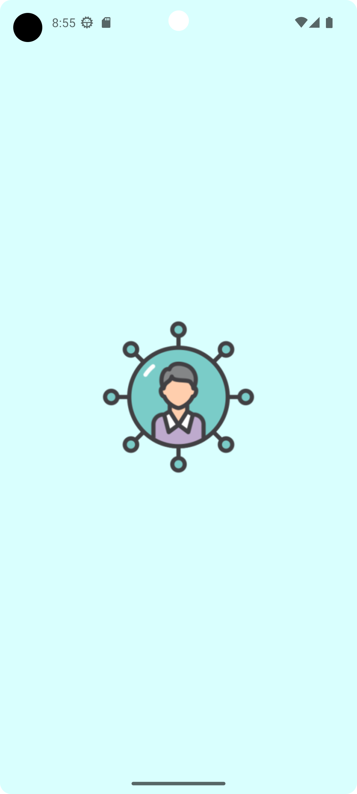

- отображение ленты постов, ленты событий и стены пользователя

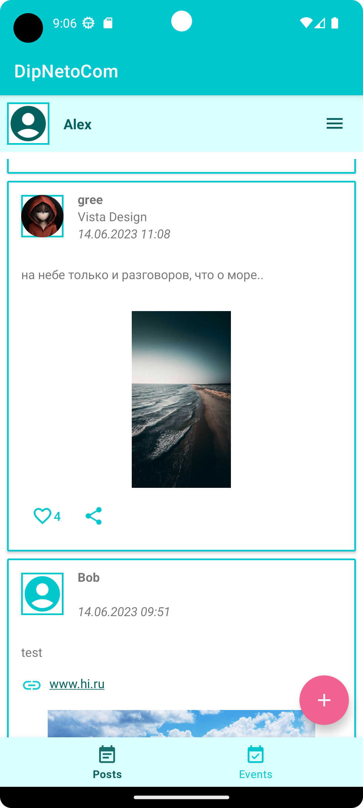      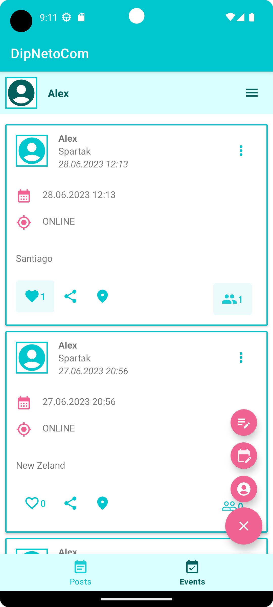      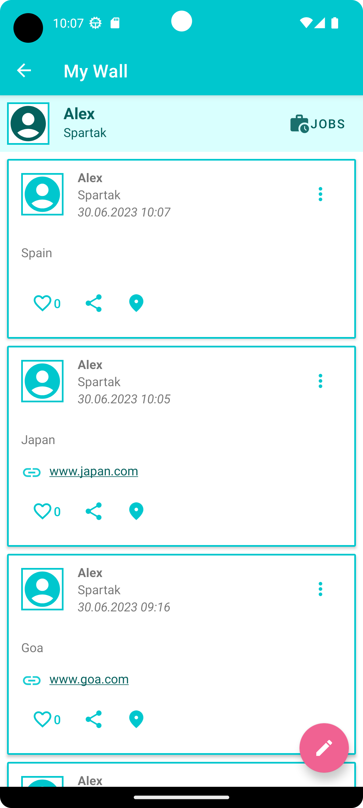

- регистрация, авторизация

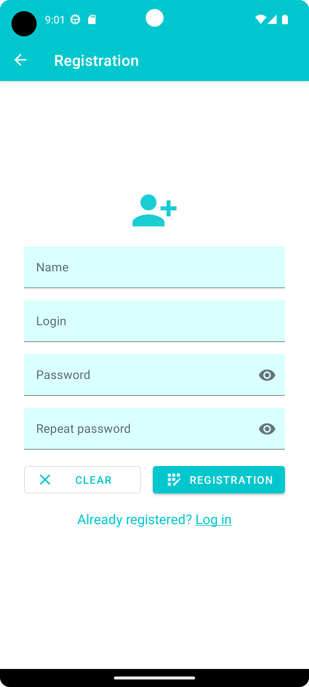      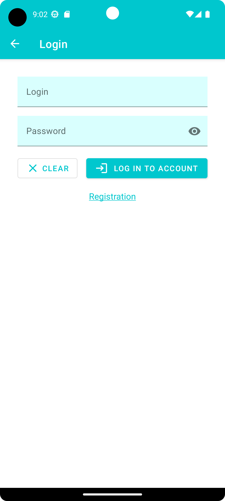

- добавление, удаление и редактирование постов, событий и работ

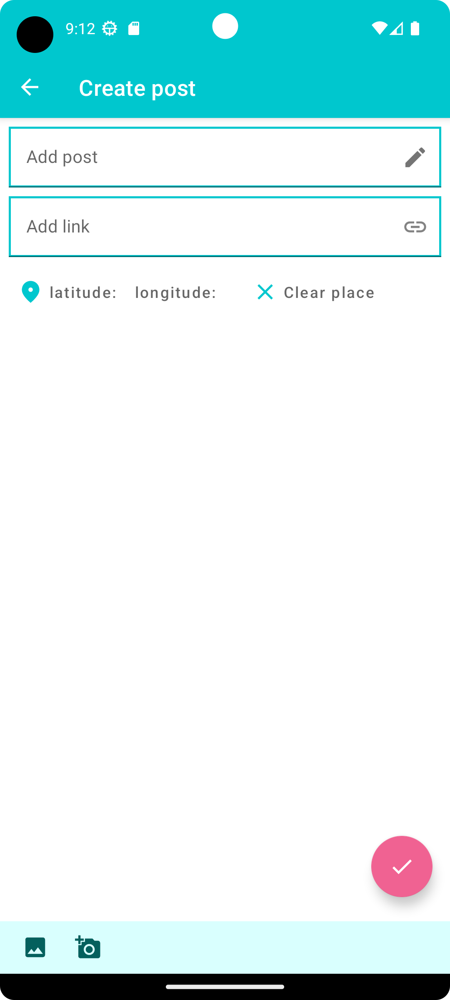      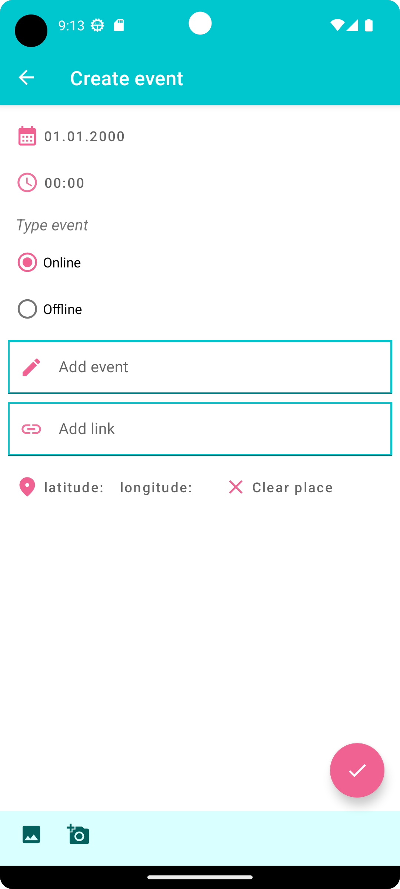      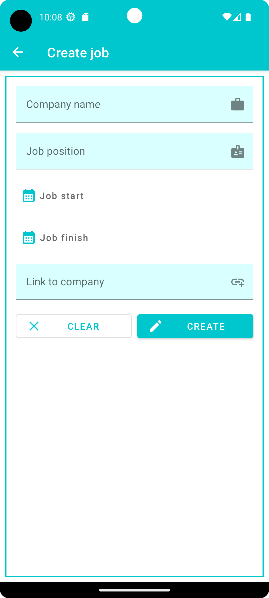      

- добавление и удаление геометки, переход по геометке, выбор даты и времени, просмотр видео и аудио
  в отдельных вкладках

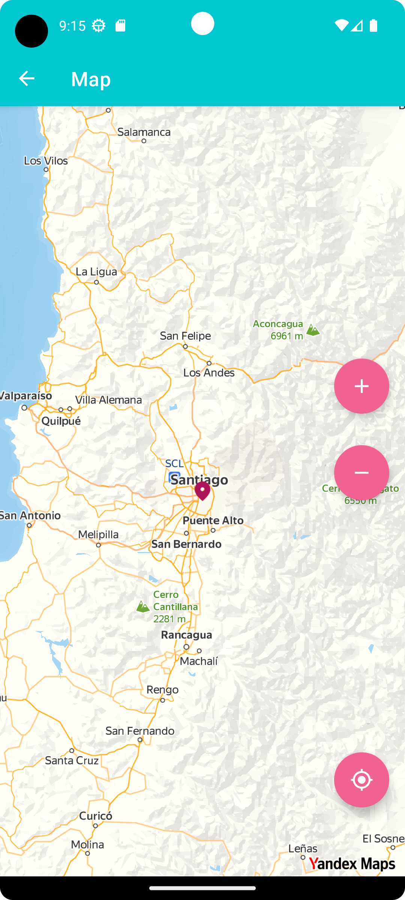      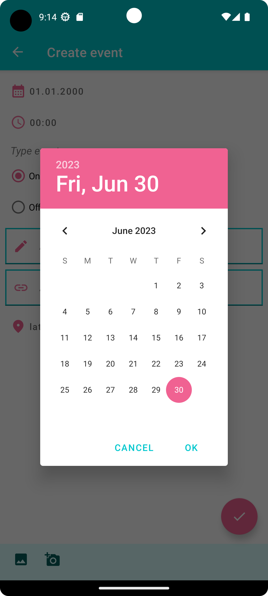      

- переход по внешним ссылкам, воспроизведение аудиофайлов, поддержка русского, английского и
  испанского языков
- и, конечно, стильная тёмная тема)

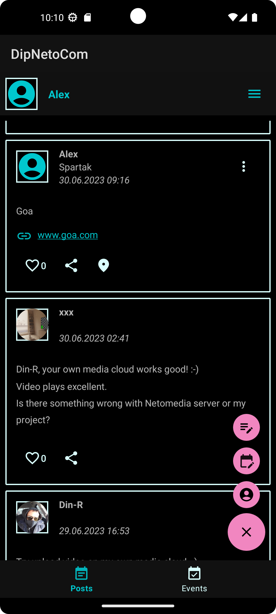

В проекте используется скрытый файл maps.properties. Для корректной работы Яндекс карты необходимо
создать файл с названием maps.properties в корневой директории проекта, 
в файле прописать строчку API_KEY = ...
Вместо ... необходимо указать уникальный Яндекс Api-key. Получить его можно здесь:
https://yandex.ru/dev/developer-help/doc/

