## Дипломная работа

**Реализовано:**

- короткая заставка с иконкой приложения

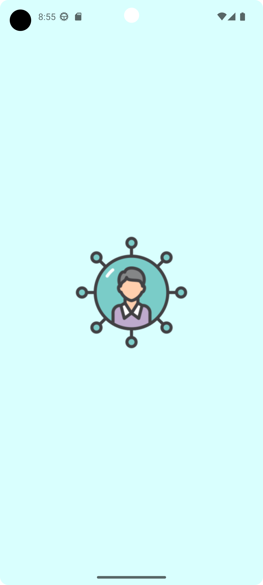

- отображение ленты постов, ленты событий и стены пользователя

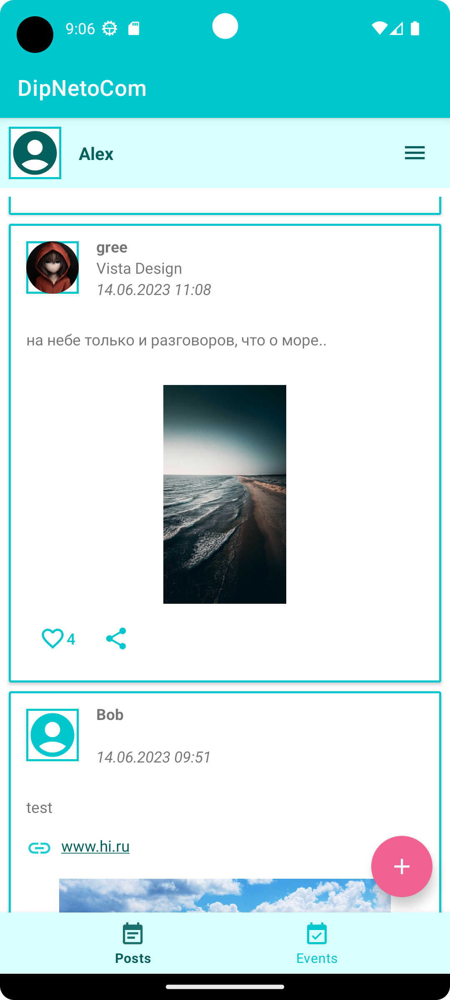      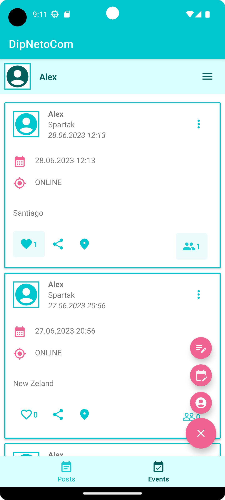      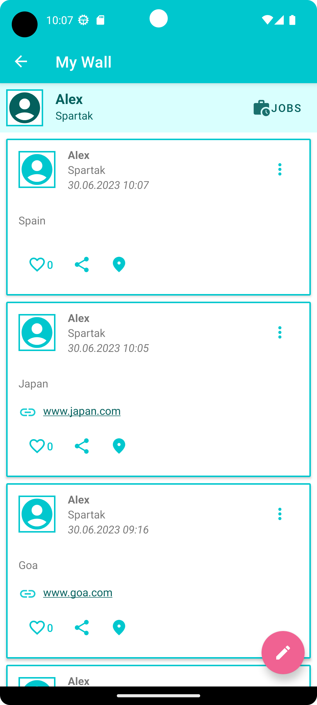

- регистрация, авторизация

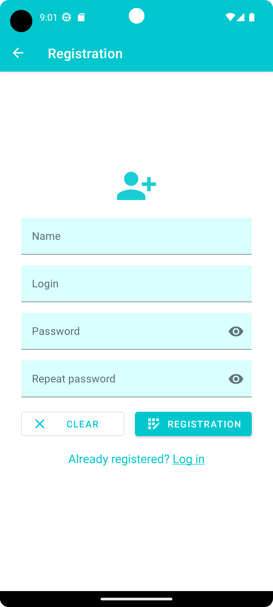      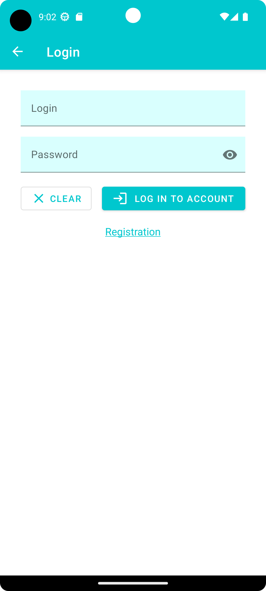

- добавление, удаление и редактирование постов, событий и работ

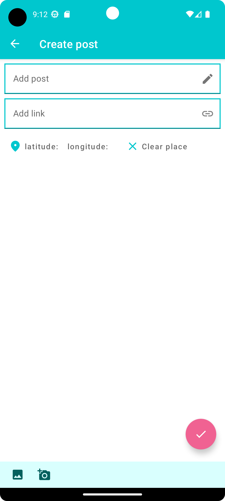      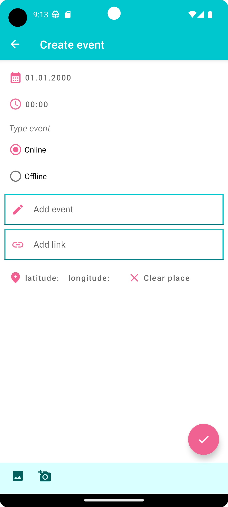      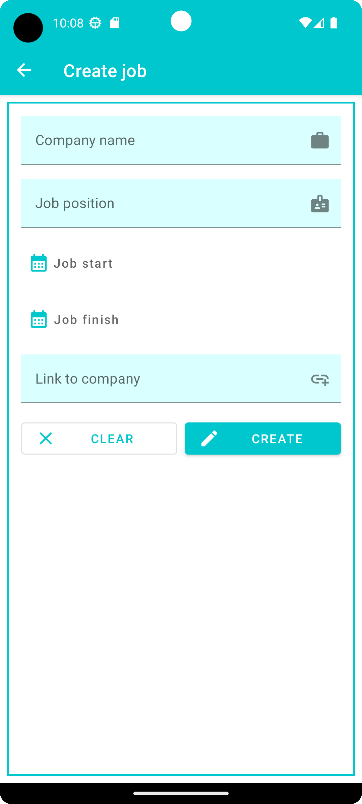      

- добавление и удаление геометки, переход по геометке, выбор даты и времени, просмотр видео и аудио
  в отдельных вкладках

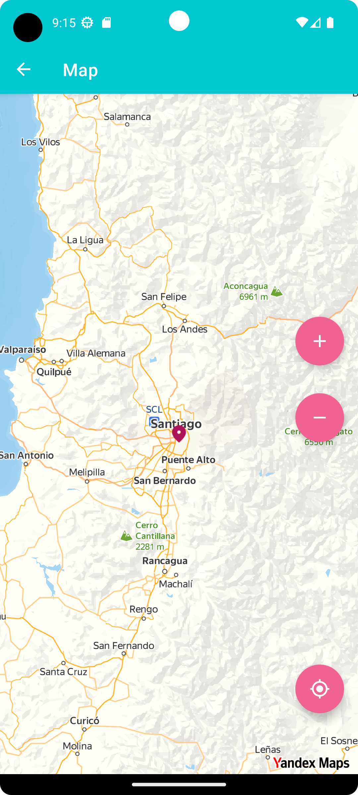      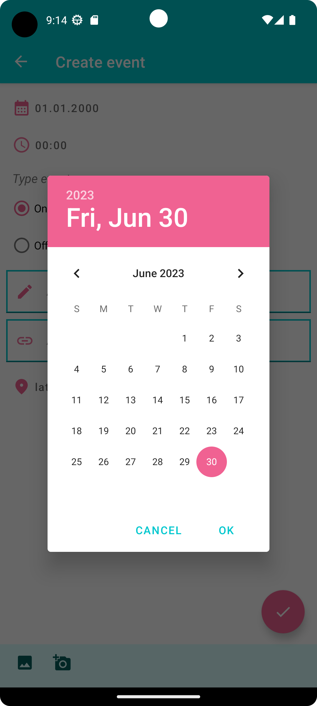      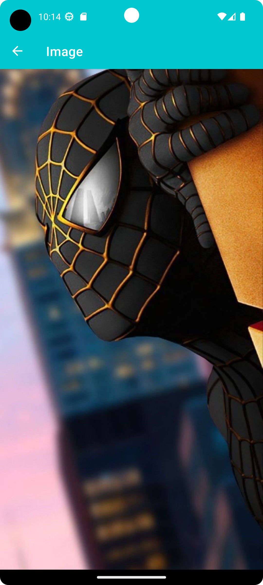

- переход по внешним ссылкам, воспроизведение аудиофайлов, поддержка русского, английского и
  испанского языков
- и, конечно, стильная тёмная тема)

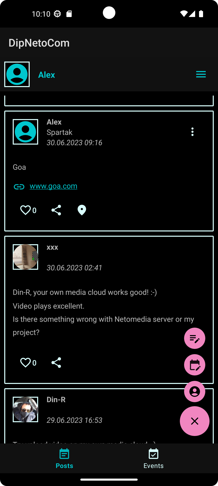

